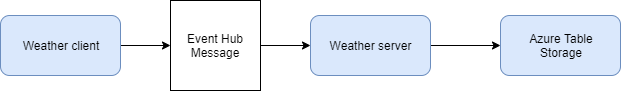

# Weather processing application

This project will build an integration pattern using a messaging subsystem. I will use Microsoft
Azure for all of my needs. The cloud generally allows for good patterns and practices and especially for
“separation of concerns”.

One interesting project that I would like to work on in the future is a renewable energy generator of data using
machine learning and big data. In order to work to make predictions around renewable energy I need
to have a good indication of the weather.
I use weather to predict how the sun affects energy production so there are several characteristics which are
necessary for us.

The most important is to take the historical weather data for a place and then use this data to train
a machine learning model. I can then begin to weather forecasts to make predictions around energy
production in the future.
The following diagram shows an integration approach to building an application which will allow daily
weather data to be produced from hourly weather data.

Developed with Python 3.8.0, using [Azure Event Hub](https://azure.microsoft.com/en-gb/services/event-hubs/), [Azure Table Storage](https://azure.microsoft.com/en-gb/services/storage/tables/) and [weatherbit API](https://weatherbit.io)